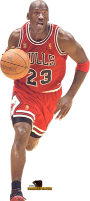

# Fight

Javascript to create fight between two   sprites 

Usage: 

Instantiate Two Player Objects 

#<html>
#  <body>
#    
#    
#  </body>
#</html>

#Javascript Code: 
var mario = document.getElementById('mario');
var jordan = document.getElementById('jordan');
